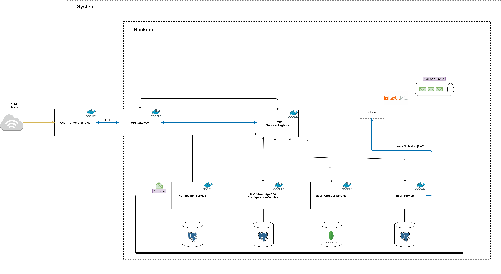

#System base architecture
  

### User-Training-Plan-Configuration-Service
Most important service - implements core functionalities related to training-plans/workouts.

### User-Service
Storing user data

### User-Workout-Service
Storing user performed workouts. Resource for statistics

### Notification-Service
Sending email notifications

### Api-Gateway
REST endpoints for FE service, agregrates data, authenticate requests.